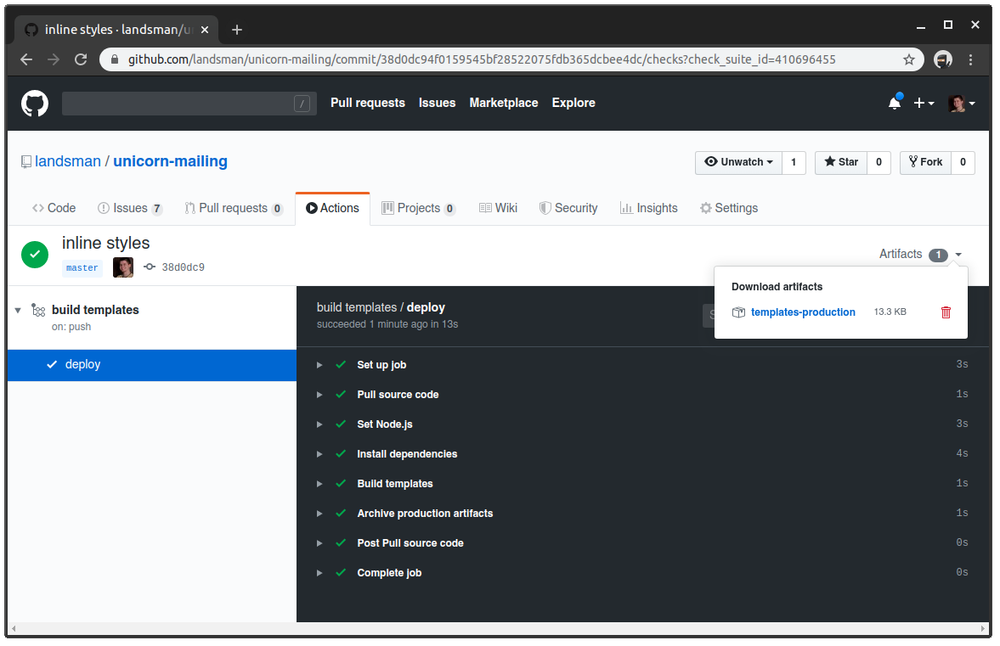

# Unicorn mailing

- will modify your template to work on almost all email clients
- versioned templates for for your peace of mind

## How to

1. fork repository, create custom branch for your change
2. make change in existing template or create new one, but **please respect folder structure**: `templates/**/name.html`
3. git commit, push and go to Actions tab in your github repository, like [mine](https://github.com/landsman/unicorn-mailing/actions)
4. wait until end of build and you would find 1 Artifacts with zip there



## Layouts

Each template can have own layout. Default is `layouts/default.html`.
Syntax for specify layout is:

```
    ---
    layout: your-nice-layout
    ---
```

This name is corresponding with file in folder `/layouts` without `.html` extension.
Check the examples.

## Sending via Mailgun

- [prepared example for NodeJS](/.doc/example-nodejs)
- [prepared example for PHP](./doc/example-php)
- you can also write your integration by own, [follow Mailgun's doc](https://documentation.mailgun.com/en/latest/api-sending.html#sending).

## Reading list

- https://documentation.mailgun.com/en/latest/user_manual.html#templates
- https://documentation.mailgun.com/en/latest/api-sending.html#sending
- https://github.com/Automattic/juice
- https://github.com/jxson/front-matter